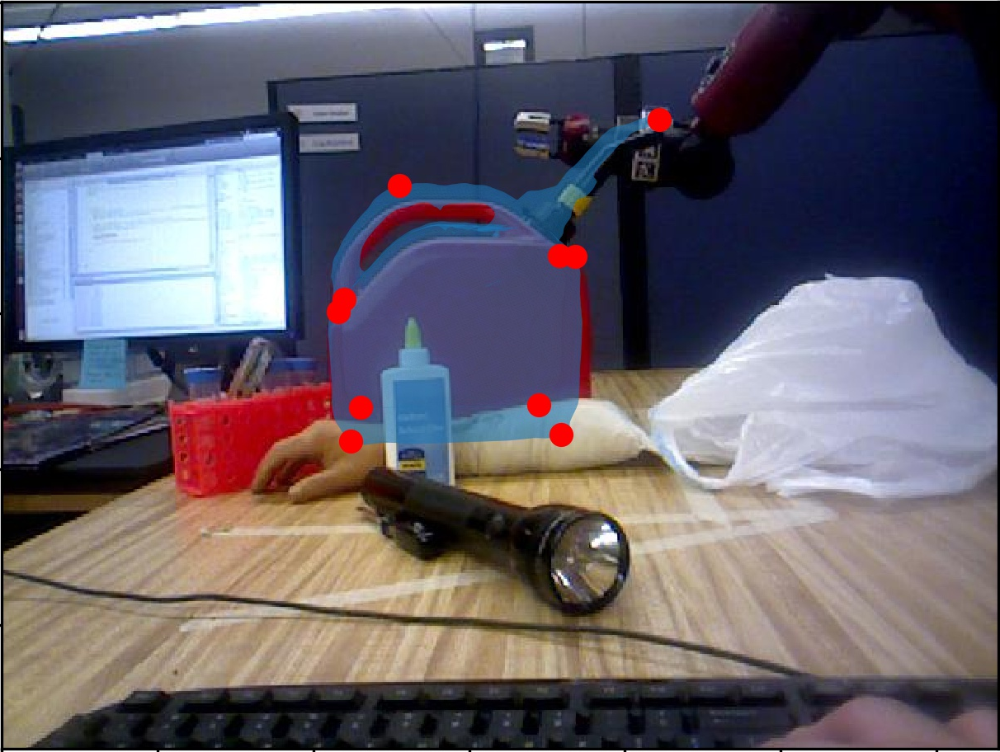

<!--<!DOCTYPE html>-->

<html>
<head>

</head>
<body>
<h1>GALLERY</h1>
  
<h2>PROGRAMMING</h2>

<h3>
  <ul class="a">
  <a href="https://github.com/cchun319/GoogleCloud_Final">
    <li>
      Cloud System
    </li>
  </a>
  </ul>
</h3>

Lorem ipsum dolor sit amet, consectetur adipiscing elit. Phasellus imperdiet, nulla et dictum interdum, nisi lorem egestas odio, vitae scelerisque enim ligula venenatis dolor. Maecenas nisl est, ultrices nec congue eget, auctor vitae massa. 

  

<h3>
  <ul class="a">
  <a href="https://github.com/cchun319/GoogleCloud_Final">
    <li>
      Chatroom
    </li>
  </a>
  </ul>
</h3>

Lorem ipsum dolor sit amet, consectetur adipiscing elit. Phasellus imperdiet, nulla et dictum interdum, nisi lorem egestas odio, vitae scelerisque enim ligula venenatis dolor. Maecenas nisl est, ultrices nec congue eget, auctor vitae massa. 

  

<h3>
  <ul class="a">
  <a href="https://github.com/cchun319/SMTP_POP3">
    <li>
      SMTP POP3 Email Server
    </li>
  </a>
  </ul>
</h3>

Lorem ipsum dolor sit amet, consectetur adipiscing elit. Phasellus imperdiet, nulla et dictum interdum, nisi lorem egestas odio, vitae scelerisque enim ligula venenatis dolor. Maecenas nisl est, ultrices nec congue eget, auctor vitae massa. 

  

<h3>
  <ul class="a">
  <a href="https://github.com/cchun319/AutoComplete">
    <li>
      AutoComplete
    </li>
  </a>
  </ul>
</h3>

Lorem ipsum dolor sit amet, consectetur adipiscing elit. Phasellus imperdiet, nulla et dictum interdum, nisi lorem egestas odio, vitae scelerisque enim ligula venenatis dolor. Maecenas nisl est, ultrices nec congue eget, auctor vitae massa. 

  

<h3>
  <ul class="a">
  <a href="https://github.com/cchun319/Aggregator">
    <li>
      Aggregator
    </li>
  </a>
  </ul>
</h3>

Lorem ipsum dolor sit amet, consectetur adipiscing elit. Phasellus imperdiet, nulla et dictum interdum, nisi lorem egestas odio, vitae scelerisque enim ligula venenatis dolor. Maecenas nisl est, ultrices nec congue eget, auctor vitae massa. 

  

<h3>
  <ul class="a">
  <a href="https://github.com/cchun319/DFS_BFS">
    <li>
      Breadth, Depth First Search
    </li>
  </a>
  </ul>
</h3>

Lorem ipsum dolor sit amet, consectetur adipiscing elit. Phasellus imperdiet, nulla et dictum interdum, nisi lorem egestas odio, vitae scelerisque enim ligula venenatis dolor. Maecenas nisl est, ultrices nec congue eget, auctor vitae massa. 

  

<h2>ROBOTICS</h2>

<h3>
  <ul class="a">
  <a href="https://github.com/cchun319/Robotics/tree/master/MAZE">
    <li>
      Drone Control
    </li>
  </a>
  </ul>
</h3>

Lorem ipsum dolor sit amet, consectetur adipiscing elit. Phasellus imperdiet, nulla et dictum interdum, nisi lorem egestas odio, vitae scelerisque enim ligula venenatis dolor. Maecenas nisl est, ultrices nec congue eget, auctor vitae massa. 

  

<h3>
  <ul class="a">
  <a href="https://github.com/cchun319/Robotics/tree/master/520/ArtificialPotentialField">
    <li>
      Artificial Potential Field
    </li>
  </a>
  </ul>
</h3>

Lorem ipsum dolor sit amet, consectetur adipiscing elit. Phasellus imperdiet, nulla et dictum interdum, nisi lorem egestas odio, vitae scelerisque enim ligula venenatis dolor. Maecenas nisl est, ultrices nec congue eget, auctor vitae massa. 

  

<h3>
  <ul class="a">
  <a href="https://github.com/cchun319/MachinePerception/tree/master/PoseMatching">
    <li>
      Pose Estimation
    </li>
  </a>
  </ul>
</h3>

Lorem ipsum dolor sit amet, consectetur adipiscing elit. Phasellus imperdiet, nulla et dictum interdum, nisi lorem egestas odio, vitae scelerisque enim ligula venenatis dolor. Maecenas nisl est, ultrices nec congue eget, auctor vitae massa. 

  

<h2>R&D & PRODUCT DESIGN</h2>

</body>
</html>
