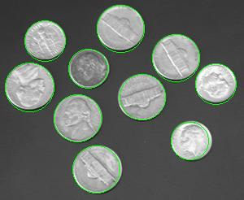
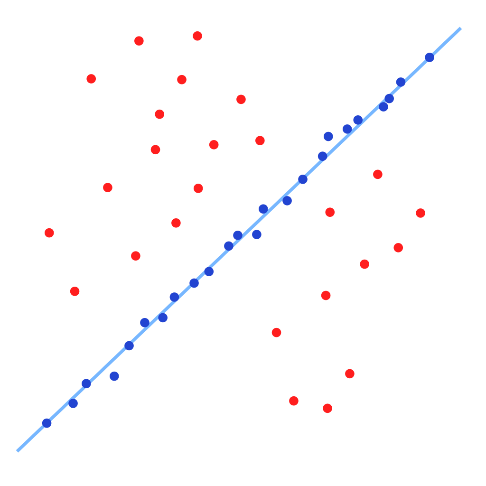

<!--<!DOCTYPE html>-->

<html>
<head>

</head>
<body>
<h1>GALLERY</h1>

<!-- ******************************************************************************************************************************************************************-->
<h2>PROGRAMMING</h2>
  
<article>
<h3>
  <ul class="a">
  <a href="https://github.com/cchun319/GoogleCloud_Final">
    <li>
      Cloud System
    </li>
  </a>
  </ul>
</h3>

The Penn-Cloud system was built on C++. It had sophiscated features including file upload, send/write email, user log in/sign up. 
It had well-designed multi-threaded servers and load balancer on both of the front-end and back-end sides. The back-end servers were also able to do the fault tolerance and files backup.

</article>
  

<article>
<h3>
  <ul class="a">
  <a href="https://github.com/cchun319/GoogleCloud_Final">
    <li>
      Chatroom
    </li>
  </a>
  </ul>
</h3>

The multi-threaded UDP chatroom supported 250 users to chat within different groups. Total ordering with the timestamps was implemented.  

</article>
  

<article>
<h3>
  <ul class="a">
  <a href="https://github.com/cchun319/SMTP_POP3">
    <li>
      SMTP POP3 Email Server
    </li>
  </a>
  </ul>
</h3>

The multi-threaded SMTP/POP3 email servers were fully compatible with Thunrderbird in linux 

</article>
  

<article>
<h3>
  <ul class="a">
  <a href="https://github.com/cchun319/AutoComplete">
    <li>
      AutoComplete
    </li>
  </a>
  </ul>
</h3>

The autocomplete imported the word list and auto-completed the search with the list. 

</article>
  

<article>
<h3>
  <ul class="a">
  <a href="https://github.com/cchun319/Aggregator">
    <li>
      Aggregator
    </li>
  </a>
  </ul>
</h3>

The aggregator used the Jsoup library to get the content from desired website by RSS feeds and scanned the words to auto-complete the search with the importance of the word. 

</article>
  

<article>
<h3>
  <ul class="a">
  <a href="https://github.com/cchun319/DFS_BFS">
    <li>
      Breadth, Depth First Search
    </li>
  </a>
  </ul>
</h3>

The BFS/DFS was a project for the visualizaion of the both algorithms. The maze was generated randomly by the union-find algorithm.

</article>
  

<article>
<h3>
  <ul class="a">
  <a href="https://github.com/cchun319/GUI_fun">
    <li>
      GUI Fun Project
    </li>
  </a>
  </ul>
</h3>

The fitting circle project was the implementation of the iterative algorithm to minimize the error to fit a circle. And it was also a practice for the visualization tool in JAVA.

</article>
  

<!-- ******************************************************************************************************************************************************************--> 
<article>

<h2>ROBOTICS</h2>
</article>
<article>
<h3>
  <ul class="a">
  <a href="https://github.com/cchun319/Robotics/tree/master/MAZE">
    <li>
      Drone Control
    </li>
  </a>
  </ul>
</h3>

  
The Drone project was an exploration of A* and Dijkstra algorithm combined with the snap control method. The reuslt was visualized by Matlab.

</article>

  
<article>
<h3>
  <ul class="a">
  <a href="https://github.com/cchun319/Robotics/tree/master/520/ArtificialPotentialField">
    <li>
      Artificial Potential Field
    </li>
  </a>
  </ul>
</h3>

The path planning of the robotics arm was achieved by Artificial Potentail Field method which makes every joint move from the high potential position(source) to the low potential positions(destination) 

</article>
  

<article>
<h3>
  <ul class="a">
  <a href="https://github.com/cchun319/MachinePerception/tree/master/PoseMatching">
    <li>
      Pose Estimation
    </li>
  </a>
  </ul>
</h3>

Implementation of pose matching by minimizing the least square error in Colab.

</article>
  
<article>
<h3>
  <ul class="a">
  <a href="https://github.com/cchun319/Robotics/tree/master/520/ArtificialPotentialField">
    <li>
      Circle Detection
    </li>
  </a>
  </ul>
</h3>

Circle detection of the photo was done by the laplacian method and analysis of frequency domain of the image.

</article>
  

<article>
<h3>
  <ul class="a">
  <a href="https://github.com/cchun319/Robotics/tree/master/520/ArtificialPotentialField">
    <li>
      RANSAC
    </li>
  </a>
  </ul>
</h3>

This project was estimation of camera's positon by calcualtion of epipolar lines and usage of RANSAC to attain the most reliable informaton from two photos.

</article>
  

<article>
<h3>
  <ul class="a">
  <a href="https://hsnu610877.wixsite.com/chunchang0819/mechatronics">
    <li>
      Robot Tank
    </li>
  </a>
  </ul>
</h3>

The battle robot was made by 3D priting parts and lazer cutting boards. The teensy chip and ESP32 were used for remote motion control, and it was coded in arduino environment. 

</article>
  
<!-- ******************************************************************************************************************************************************************-->
<article>

<h2>R&D & PRODUCT DESIGN</h2>
</article>

<article>
<h3>
  <ul class="a">
  <a href="https://hsnu610877.wixsite.com/chunchang0819/litemed-iaso">
    <li>
      Extracorporeal Shockwave Machine
    </li>
  </a>
  </ul>
</h3>

Revamped the Extracorporeal Shockwave Machine with lower cost of the shell, high efficiency assembly method, better water routing arrangement and heat exhausting design.

</article>
</body>
</html>
